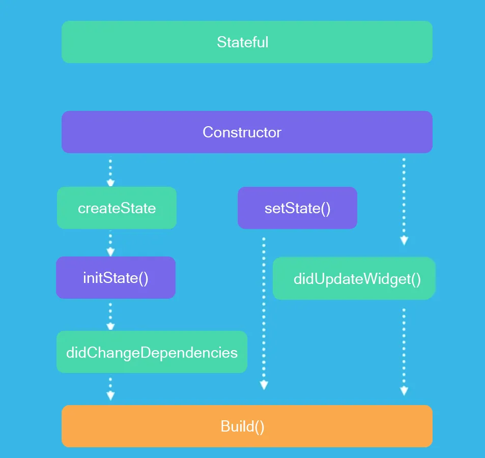

# 2025-03-06-state-management

# 📚 오늘의 학습 내용

> 오늘은 플러터 상태관리에 대해서 공부를 했다. vue에서도 state를 통해서 state 내의 값이 바뀌었을 때 바로바로 웹사이트에 뿌려줄 수 있었는데 그것과 개념이 비슷해서 화면에서 특정 값이 바뀌었을 때 그것을 실시간으로 보여주고 또 전체화면을 다시 빌드해서 보여주면 메모리가 많이 사용되기 때문에 바뀌는 부분만 다시 빌드할 수 있도록 GetX라는 Third Party Library를 사용하는 것을 배우게 되었다.

## ✍️ 주요 학습 내용

- 배운 내용
  - 상태관리에 대해서 배웠는데 기본적으로 화면 내의 어떤 값이 바뀔 때 내부적으로는 바뀐 값을 저장하고 있지만 그 값을 화면에 뿌려주지 않기 때문에 내부적으로는 값이 바뀌어도 화면은 전혀 바뀌지 않는 것을 볼 수 있다.
  - 그렇기 때문에 앱에게 값이 바뀌었다는 것을 알리고 화면을 다시 띄울 수 있게 하는 게 필요하고 이것이 상태관리인 것 같다.
  - 처음에 `StatefulWidget`과 `StatelessWidget` 을 배우는데 `StatelessWidget` 은 중간에 값이 바뀌지 않기 때문에 동일한 화면을 보여주면 되는데 `StatefulWidget` 은 중간의 어떤 값이 바뀌기 때문에 바뀐 값을 화면에 보여주기 위해서 빌드를 다시 하게 된다.
  - `StatefulWidget` 의 생애주기
    
  - 이것은 `StatefulWidget`의 생애주기인데 빌드라는 것을 해야 화면을 다시 띄우게 된다. 그렇기 때문에 변경된 값을 보여주기 위해서는 `setState()` 혹은 `didUpdateWidget()` 을 사용해서 빌드를 진행해 줘야 한다.
  - `StatefulWidget` 의 한계
    - `flutter` 는 위젯 트리라고 해서 위젯 간의 계층 구조가 있는데 가장 하위의 위젯에서 어떤 값을 변경하게 되면 그 변경된 값을 `StatefulWidget` 에게 까지 전달을 해줘야 되고 그 값을 또 나타내 주기 위해서 그 값을 보여주는 위젯까지 변경된 값을 전달해줘야 하는데 그렇기 때문에 이런 상태 공유가 어렵고 비효율적으로 된다.
  - 따라서 이러한 한계점들을 해결하기 위해서 다양한 써드 파티 라이브러리를 이용하게 되는데 대표적으로 4가지가 있다고 한다.
    - Provider
    - GetX
    - Bloc/Cubit
    - Riverpod
  - 하지만 여기서 우리는 `GetX`를 사용하기로 했고 `GetX` 를 통해서 상태에 변경이 생기면 흔히 `Controller` 라고 불리는 중앙 집중 상태에 바로 변경된 값을 알려주고 그 값을 뿌려줘야 하는 위젯에 바로 보낼 수 있어서 간편하게 상태관리를 할 수 있게 되었다.
- 새로 알게된 개념
  - 상태관리의 개념
  - `StatefulWidget` 의 한계점
  - `GetX` 의 존재?
- 실습한 내용
  - 단어 장바구니 앱 실습

## 🚨 발생한 문제/에러

- 따로 발견한 문제/에러는 없었다.

## 📝 코드 스니펫

```dart
// 오늘 배운 주요 코드
import 'package:get/get.dart';

class ProductController extends GetxController {}
```

## 📚 내일 학습할 내용

- 오늘 밤 중으로 5주차까지 강의를 다 듣고 개인과제를 제출할 예정!

## 💭 오늘의 회고

### 잘한 점 👍

- 강의를 많이 듣지는 못했지만 그래도 위젯 및 상태관리에 대해서 익숙해지고 깊이 이해해 가는 것 같다.

### 개선할 점 🔨

- 온라인으로 진행되다 보니 조금 더 시간관리를 잘해야 될 것 같다.

### 배운 점 💡

- State Management
- `StatefulWidget`의 한계
- Third Party Library : `GetX`

## ✏️ 참고 자료

- Flutter 공식 문서: [https://docs.flutter.dev](https://docs.flutter.dev)
