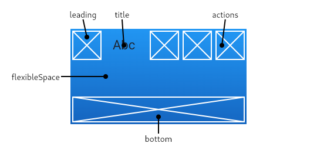

# 2025-03-25-flutter-recipe-app

# 📚 오늘의 학습 내용

<details>
<summary>오늘에 코딩</summary>
<div markdown="1">

<aside>
❓

주어진 문자열이 팰린드롬인지 확인하는 문제입니다.
팰린드롬이란, 앞에서 읽으나 뒤에서 읽으나 동일한 문자열을 의미합니다.
대소문자와 공백을 무시하고, 알파벳과 숫자만 비교합니다.

</aside>

```dart
class Solution {
  bool isPalindrome(String s) {
    String result = s.replaceAll(RegExp('[^a-zA-Z]'), "").toLowerCase();

    String reverseResult = result.split('').reversed.join();

    if (result == reverseResult) {
      return true;
    } else {
      return false;
    }
  }
}

void main() {
  Solution solution = Solution();

  print(solution.isPalindrome("A man, a plan, a canal: Panama"));
  print(solution.isPalindrome("race a car"));
}

```

### 알게 된 점

- 정규표현식

[정규표현식 (Regex) 정리](https://hamait.tistory.com/342)

[xy]

- 문자 선택을 표현하며 x와 y 중에 하나를 의미한다.

[^xy]

- `^` 은 not을 표현하며 x 및 y를 제외한 문자를 의미한다.

- replaceAll([정규표현식], ‘[넣고 싶은 문자열]’)

`RegExp(’RegExp('[^a-zA-Z]'))`

- 영어 소문자 및 대문자가 아닌 모든 것을 ‘’로 바꾸는 작업
- 문자열.toLowerCase() → 소문자로 바꾸기
- 문자열.toUpperCase() → 대문자로 바꾸기

- 문자열 거꾸로 바꾸기
  - `string.split(’’).reversed.join()`
  - `split(’’)` : 모든 문자를 쪼개서 리스트로 만들어 줌
  - `reversed` : 배열 순서를 거꾸로 뒤집어 줌
  - `join()` : 문자열의 리스트를 주어진 문자로 연결한다.
  ```dart
  const t = words.join('.'); //
  print(t); // root.*.0.0.System Administrator./var/root./bin/sh
  ```

</div>
</details>

## ✍️ 주요 학습 내용

### 배운 내용

- AppBar()
- 폰트 파일 추가
- 클래스는 대문자로 구분하는 파스칼 표기법 사용
- 파일이름은 소문자로 작성하고 띄어쓰기는 \_로 구분짓는 스네이크 표기법 사용
  - 이것을 코드 컨벤션이라고 함.

### 새로 알게된 개념

<details>
<summary>컴포넌트화 하기</summary>
<div markdown="1">

### 목적

1. 코드의 간결화
   1. Scaffold 내에서 모든 요소들을 구현할 수도 있지만 그렇게 될 경우 한 파일에 코드가 너무 길어짐
   2. 가독성 떨어짐
2. 코드의 재사용
3. 유지보수 편의성

</div>
</details>

<details>
<summary>폰트 추가</summary>
<div markdown="1">

```yaml
# 각각의 font weight에 해당하는 폰트파일을 지정해두면
# Text 위젯의 style에서 fontWeight를 지정하면 해당 fontWeight에
# 해당하는 폰트를 지정해줌
fonts:
  - family: NotoSansKR
    fonts:
      - asset: fonts/NotoSansKR-Thin.ttf
        weight: 100
      - asset: fonts/NotoSansKR-ExtraLight.ttf
        weight: 200
      - asset: fonts/NotoSansKR-Light.ttf
        weight: 300
      - asset: fonts/NotoSansKR-Regular.ttf
        weight: 400 # FontWeight.normal
      - asset: fonts/NotoSansKR-Medium.ttf
        weight: 500
      - asset: fonts/NotoSansKR-SemiBold.ttf
        weight: 600
      - asset: fonts/NotoSansKR-Bold.ttf
        weight: 700 # FontWeight.bold
      - asset: fonts/NotoSansKR-ExtraBold.ttf
        weight: 800
      - asset: fonts/NotoSansKR-Black.ttf
        weight: 900
```

### MaterialApp 의 theme 속성에 추가

```dart
MaterialApp(
	theme : ThemeData(fontFamily : 'NotoSansKR'),
	home : const MyHomePage(),
)
```

</div>
</details>

<details>
<summary>`AppBar()`</summary>
<div markdown="1">



- leading
- title
- actions
- flexibleSpace
- bottom

</div>
</details>

<details>
<summary>아이콘</summary>
<div markdown="1">

```dart
Icon(
	Icons.favorite,
	color : Colors.pink,
	size : 24.0
)
```

- CupertinoIcons → 아이폰 친화된 아이콘들

</div>
</details>

<details>
<summary>Container Widget</summary>
<div markdown="1">

- width 와 height 크기를 가지는 상자위젯
- 크기를 지정하지 않고 자식 위젯이 없는 경우 크게 확장하려고 하고 자식 위젯이 있는 경우 자식에 크기를 맞추려고 함
- Container vs SizedBox
  - Container 에는 **margin, padding** 등의 속성으로 여백을 지정할 수 있음
    - margin : Container 바깥의 여백
    - padding : Container 안의 여백
  - **decoration** 속성을 이용해 속성을 이용해 배경색, 테두리, 모서리 둥글기 등을 지정할 수 있음
  - **transform** 속성을 이용해 자식 위젯을 회전시키거나 확대할 수 있음
  - **alignment** 속성으로 자식위젯의 정렬을 지정할 수 있음
  - 등등의 속성을 지원하지만 다양한 속성을 지원하는 만큼 SizedBox에 비해서 복잡하다
    - 다른말로 무겁고 성능이 좋지않다(SizedBox에 비해)
    - 단순히 크기만 정할경우 SizedBox, 꾸밀땐 Container 사용

</div>
</details>

<details>
<summary>기타 위젯들</summary>
<div markdown="1">

`ListView Widget`

- 가장 일반적으로 사용되는 스크롤 위젯

`AspectRatio()`

```dart
AspectRatio(
	aspectRatio : 16/9,
	child : Container (color : Colors.green)
)
```

`ClipRRect`

```dart
ClipRRect(
	borderRadius : BorderRadius.circular(10),
	child : Image.assets("assets/test.jpg"),
)
```

</div>
</details>

### 실습한 내용

- 레시피 앱 제작

## 🚨 발생한 문제/에러

- 아직은 없었음

## 📝 코드 스니펫

```dart
// 오늘 배운 주요 코드
ClipRRect(
	borderRadius : BorderRadius.circular(30),
	child : Image.assets("assets/test.jpg"),
)
```

## 📚 내일 학습할 내용

- 플러터 강의 마무리
- 개인과제

## 💭 오늘의 회고

### 잘한 점 👍

- 마지막 빡집중

### 개선할 점 🔨

- 오전 시간 잘 활용하기

### 배운 점 💡

- 여러 위젯들

## ✏️ 참고 자료

- Flutter 공식 문서: [https://docs.flutter.dev](https://docs.flutter.dev)
