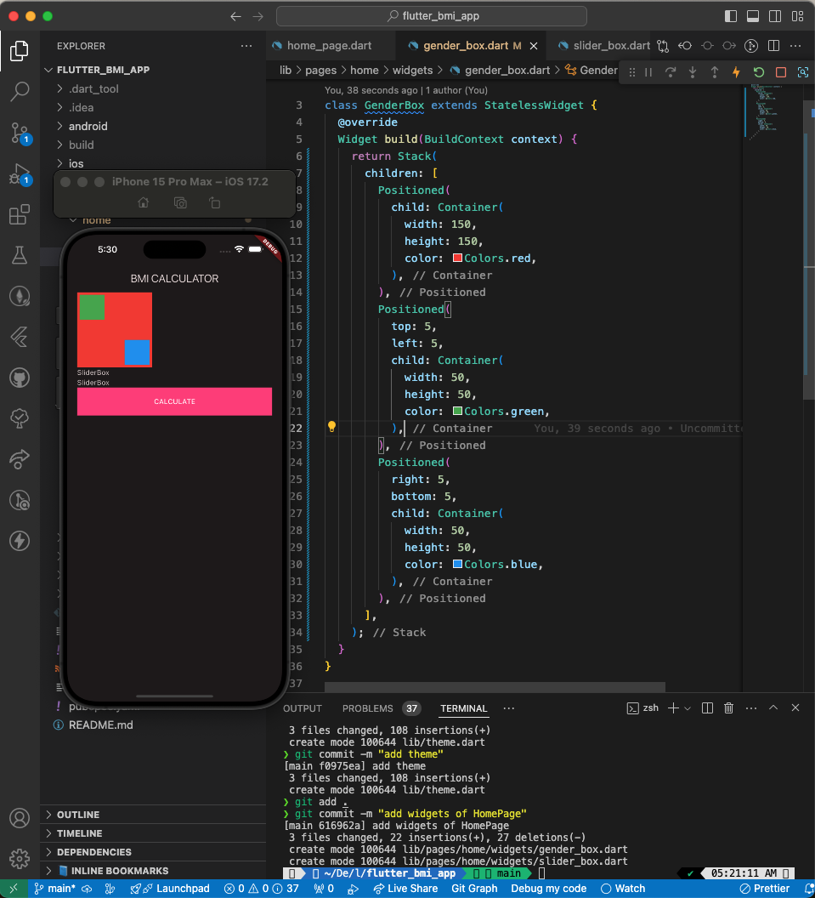
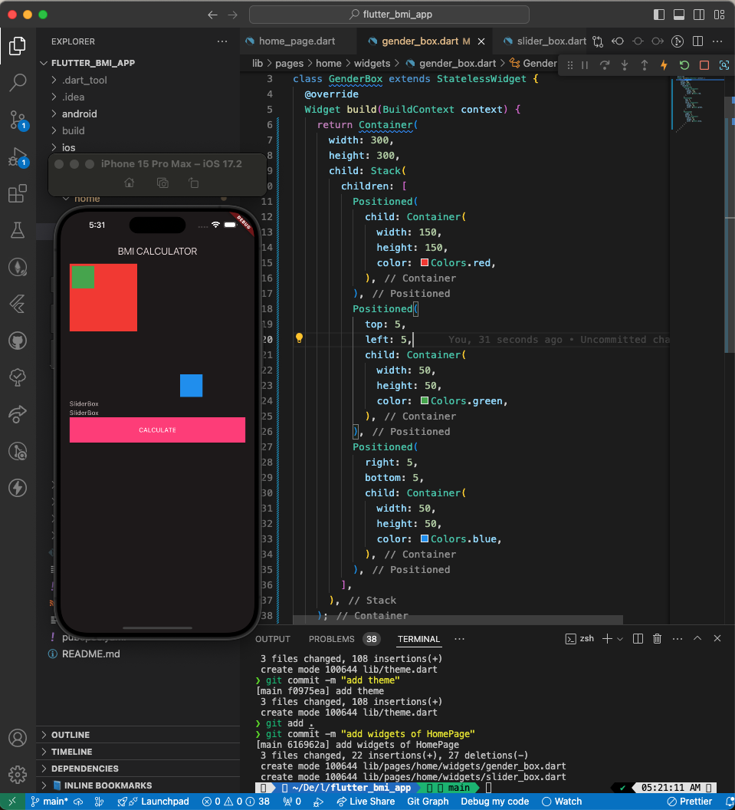

# 2025-03-27-flutter-bmi-app

# 📚 오늘의 학습 내용

BMI앱을 만들어 보면서 테마 설정 부분을 배울 수 있었다. 라이트 테마, 다크 테마를 통해서 전체적인 색상을 변경할 수 있었고 또 시스템 옵션을 선택하는 것을 통해서 휴대폰의 설정에 맞게 테마를 정할 수도 있었다.

그리고 네비게이터를 활용해서 화면 이동에 대해서 배울 수 있었다. 스택 구조로 위의 화면이 쌓이는 구조고 거기서 한 칸씩 뒤로 나오는 구조였다. 새로운 위젯들도 많이 나왔는데 확실히 처음부터 내가 만들어 봐야 내 것으로 만들 수 있을 것 같다.

## ✍️ 주요 학습 내용

### 배운 내용

- 테마 설정
- 네비게이터

### 새로 알게된 개념

### 프로젝트 폴더 관리

- `lib` 안에 `pages` 폴더를 넣고 그 안에 페이지 별로 폴더를 만들고 그 안에 `widgets` 폴더를 만들고 그 페이지에서 사용되는 위젯들을 넣음

```dart
- lib
	- pages
		- home
			- home_page.dart
			- widgets // HomePage 내에서 사용할 위젯들
		- result
			- result_page.dart
			- widgets // ResultPage 내에서 사용할 위젯들
	- widgets // 앱 내에서 전체적으로 함께 사용되는 위젯들. 이번 프로젝트에서는 쓸일이 없음.
```

<details>
<summary>새로운 위젯</summary>
<div markdown="1">

- Slider
  ```dart
  Slider(
  	// 값 - 여기서는 테마 확인을 위해 고정값을 넣었지만
  	// 사용할 때에는 변수를 넣고 onChanged에서 해당 변수의 값을 바꿔주고
  	// setState 호출해서 사용
    value: 1,
    onChanged: (v) {},
    min: 1, // 최소값
    max: 300, // 최대값
  )
  ```
- CircularProgressIndicator

  ```dart
  import 'dart:math';

  import 'package:flutter/material.dart';

  class ResultGauge extends StatelessWidget {
    const ResultGauge(this.result);
    final double result;
    @override
    Widget build(BuildContext context) {
      return Stack(
        alignment: Alignment.center,
        children: [
          // 가로 세로가 같은 SizedBox를 사용할 때
          SizedBox.square(
            dimension: 250,
            child: CircularProgressIndicator(
              value: 1,
              strokeWidth: 2,
              color: Theme.of(context).dividerColor,
            ),
          ),
          SizedBox.square(
            dimension: 250,
            child: CircularProgressIndicator(
              value: min((result / 35), 1), // BMI max 35!
              strokeWidth: 3,
              color: Theme.of(context).highlightColor,
            ),
          ),
          // Stack 의 크기가 자녀위젯의 크기에 따라 달라지므로 Center 사용 불가
          Text(
            result.toStringAsFixed(1),
            style: TextStyle(fontSize: 20),
          ),
        ],
      );
    }
  }

  ```

- Stack (여러 자식 위젯들을 겹칠 때 사용)
  - 겹치는 거라면서요? GenderBox안의 Container는 안겹치는데요?
    - Stack 내에는 Positioned라는 위젯을 사용 가능
      - Positioned 위젯이란?
        - left, top, right, bottom 속성을 이용해 Stack에 위젯을 자유롭게 배치할 때 사용
      - 사용방법
        ```dart
        Stack(
            children: [
              Positioned(
                child: Container(
                  width: 150,
                  height: 150,
                  color: Colors.red,
                ),
              ),
              Positioned(
                top: 5,
                left: 5,
                child: Container(
                  width: 50,
                  height: 50,
                  color: Colors.green,
                ),
              ),
              Positioned(
                right: 5,
                bottom: 5,
                child: Container(
                  width: 50,
                  height: 50,
                  color: Colors.blue,
                ),
              ),
            ],
          )
        ```
        
  - 주의할 점
    - Stack을 감싸고 있는 부모위젯의 크기가 없을때에는 자식위젯의 가장 큰 위젯을 기준으로 크기가 결정
    - 부모위젯의 크기가 있을 경우 부모위젯의 크기를 기준으로 크기를 결정합니다.
      

</div>
</details>

<details>
<summary>테마 적용</summary>
<div markdown="1">

공식문서

[Use themes to share colors and font styles](https://docs.flutter.dev/cookbook/design/themes)

- MaterialApp 의 theme, darkTheme 속성에 ThemeData 클래스를 정의해서 사용
- `lib/theme.dart` 파일 생성 후 분리
- 예시

  ```dart
  import 'package:flutter/material.dart';

  final lightTheme = ThemeData(
    useMaterial3: true,
    colorScheme: ColorScheme.fromSeed(
      seedColor: Colors.pinkAccent,
      brightness: Brightness.light,
    ),
    highlightColor: Colors.pinkAccent,
    dividerColor: Colors.black38, // black opacity 38%
    sliderTheme: SliderThemeData(
      activeTrackColor: Colors.black38,
      inactiveTrackColor: Colors.black38,
      trackHeight: 1,
      thumbColor: Colors.pinkAccent,
    ),
    elevatedButtonTheme: ElevatedButtonThemeData(
      style: ButtonStyle(
        shape: MaterialStatePropertyAll(RoundedRectangleBorder()),
        backgroundColor: MaterialStatePropertyAll(Colors.pinkAccent),
        foregroundColor: MaterialStatePropertyAll(Colors.white),
      ),
    ),
    outlinedButtonTheme: OutlinedButtonThemeData(
      style: ButtonStyle(
        shape: MaterialStatePropertyAll(RoundedRectangleBorder()),
        side: MaterialStatePropertyAll(BorderSide(color: Colors.black38)),
        foregroundColor: MaterialStatePropertyAll(Colors.black),
      ),
    ),
  );

  final darkTheme = ThemeData(
    useMaterial3: true,
    colorScheme: ColorScheme.fromSeed(
      seedColor: Colors.pinkAccent,
      brightness: Brightness.dark,
    ),
    highlightColor: Colors.pinkAccent,
    dividerColor: Colors.white30, // white opacity 30%
    sliderTheme: SliderThemeData(
      activeTrackColor: Colors.white30, // 현재값 기준 왼쪽 색상
      inactiveTrackColor: Colors.white30, // 현재값 기준 오른쪽 색상
      trackHeight: 1, // 막대기 높이(두께)
      thumbColor: Colors.pinkAccent, // 동그라미 (현재값)
    ),
    elevatedButtonTheme: ElevatedButtonThemeData(
      style: ButtonStyle(
        shape: MaterialStatePropertyAll(RoundedRectangleBorder()),
        backgroundColor: MaterialStatePropertyAll(Colors.pinkAccent), // 배경색
        // 전경색 (Text 등 child 위젯의 색상)
        foregroundColor: MaterialStatePropertyAll(Colors.white),
      ),
    ),
    outlinedButtonTheme: OutlinedButtonThemeData(
      style: ButtonStyle(
        shape: MaterialStatePropertyAll(RoundedRectangleBorder()),
        side: MaterialStatePropertyAll(BorderSide(color: Colors.white30)),
        foregroundColor: MaterialStatePropertyAll(Colors.white),
      ),
    ),
  );
  ```

- ThemeData 정의
  ```dart
  ThemeData(
      useMaterial3: true, // Material3 디자인 사용여부 2와의 차이는 아래 그림 참조
       // ColorScheme 클래스의 fromSeed 생성자를 사용하면
       // seedColor 를 기준으로 각각 요소들의 색상을 정해줍니다.
      colorScheme: ColorScheme.fromSeed(
        seedColor: Colors.purple,
        // dark, light 에 따라 디자인이 배경 색상 등이 다크모드, 라이트모드로 달라집니다
        brightness: Brightness.dark,
      ),
      // 앱 내에서 사용할 TextTheme 를 정할수도 있는데
      // displayLarge, titleLarge 등의 속성별로 정의할 수 있습니다.
      textTheme: TextTheme(
        displayLarge: const TextStyle(
          fontSize: 72,
          fontWeight: FontWeight.bold,
        ),
        // ···
        titleLarge: GoogleFonts.oswald(
          fontSize: 30,
          fontStyle: FontStyle.italic,
        ),
        bodyMedium: GoogleFonts.merriweather(),
        displaySmall: GoogleFonts.pacifico(),
      ),
    ),
  ```
- 예시

  ```dart
  Widget build(BuildContext context) {
      return MaterialApp(
  	    themeMode : ThemeMode.dark,
        theme: ThemeData(
          useMaterial3: true,
          highlightColor: Colors.pinkAccent,
          colorScheme: ColorScheme.fromSeed(
            seedColor: Colors.pinkAccent,
            brightness: Brightness.light,
          ),
          dividerColor: Colors.black38, // black opacity 38%
          sliderTheme: SliderThemeData(
            activeTrackColor: Colors.black38,
            inactiveTrackColor: Colors.black38,
            trackHeight: 1,
            thumbColor: Colors.pinkAccent,
          ),
          elevatedButtonTheme: ElevatedButtonThemeData(
  				  style: ButtonStyle(
  					  // 꼭지점 둥글게
  					  shape: WidgetStateProperty(RoundedRectangleBorder()),
  					  backgroundColor: MaterialStatePropertyAll(Colors.pinkAccent), // 배경색
              // 전경색 (Text 등 child 위젯의 색상)
              foregroundColor: MaterialStatePropertyAll(Colors.white),
  				  ),
  				),
  				outlinedButtonTheme: OutlinedButtonThemeData(
  				  style: ButtonStyle(
  					  shape: WidgetStateProperty(RoundedRectangleBorder()),
  					  side: MaterialStatePropertyAll(BorderSide(color: Colors.black38)),
              foregroundColor: MaterialStatePropertyAll(Colors.black),
  				  )
  				),
        ),
        darkTheme: ThemeData(
          useMaterial3: true,
          colorScheme: ColorScheme.fromSeed(
            seedColor: Colors.pinkAccent,
            brightness: Brightness.dark,
          ),
        ),
        home: HomePage(),
      );
    }
  ```

- 내부 Container의 가장자리 선 색상을 Theme을 통해서 정할 수 없음 → theme에 색상을 넣어주고 그 색상을 Container에서 사용 가능

1. Theme에 색상 추가(dividerColor)

```dart
theme: ThemeData(
    useMaterial3: true,
    colorScheme: ColorScheme.fromSeed(
      seedColor: Colors.pinkAccent,
      brightness: Brightness.light,
    ),
    dividerColor: Colors.black38, // black opacity 38%
  ),
```

1. Container에서 Theme Color 가져오기

→ `Theme.of(context).[색상명]`

```dart
Container(
  width: 80,
  height: 80,
  decoration: BoxDecoration(
    border: Border.all(
      color: Theme.of(context).dividerColor,
    ),
  ),
),
```

</div>
</details>

<details>
<summary>개발 꿀팁</summary>
<div markdown="1">

**→ 넘기는 변수가 3개 이상일 때는 named parameter 로 하면 클래스 생성시 이름이 나옴**

→ toStringAsFixed(0) 소수점 몇 번째 자리까지 나오게 할지 정하는 것

</div>
</details>

### 실습한 내용

- BMI 앱 만들기

## 🚨 발생한 문제/에러

- 없었음

## 📝 코드 스니펫

```dart
// 오늘 배운 주요 코드
HomePage({
	required this.label,
	required this. value,
	required this.unit}
);
```

## 📚 내일 학습할 내용

- 개인 과제

## 💭 오늘의 회고

### 잘한 점 👍

- 강의 집중함

### 개선할 점 🔨

- 중간에 졸아버림

### 배운 점 💡

- 테마 설정

## ✏️ 참고 자료

- Flutter 공식 문서: [https://docs.flutter.dev](https://docs.flutter.dev)
