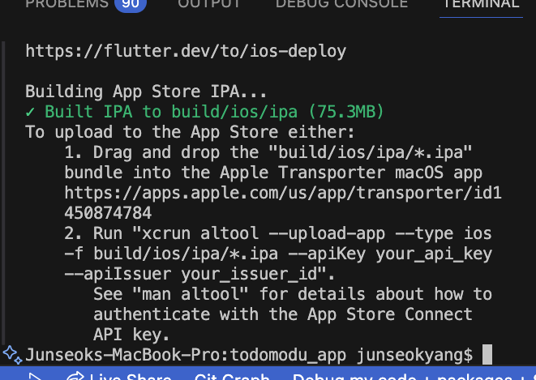

# 📚 오늘의 학습 내용

- 앱스토어 빌드 실패 트러블슈팅

---

## 🚨 발생한 문제/에러

### 1. 문제/에러 정의

xcode에서 ios 폴더를 연 후 product / archive 를 통해서 apple connect에 배포를 해야되는데 배포가 되지 않고 아래 에러와 함께 빌드 실패가 나옴

> Signing for "Runner" requires a development team. Select a development team in the Signing & Capabilities editor.

### 2. 시도한 해결 방법

- flutter clean & flutter pub get
- 프로젝트 다시 clone하기
- pod install

### 3. 최종 해결 방법

- 튜터님이 알려준 공식홈페이지의 가르침대로 했더니 잘 됐다!

[Build and release an iOS app](https://docs.flutter.dev/deployment/ios#upload-the-app-bundle-to-app-store-connect)

- xcode 에서 `open existing project` → targets / runnser → Identity : build 숫자 하나씩 올려주기
- `flutter build ipa` 터미널에서 실행 → 배포하기 위한 파일들을 만들어 줌
- 실행 후에 이런 안내 메시지를 만들어 줌

  

- transporter 앱을 다운받음
- transporter 앱에 **“`build/ios/ipa/투두모두.ipa`” 를 드래그 앤 드랍 해버리면 빌드 끝!**

### 4. 새롭게 알게 된 점

- 빌드를 반드시 xcode - product / archive 로만 해야 되는 줄 알았는데 직접 파일을 transporter를 통해서 업로드할 수 있었음

## 💭 오늘의 회고

### 잘한 점 👍

- 배포 성공

### 개선할 점 🔨

- 배포에 너무 오래 걸림

### 배운 점 💡

## ✏️ 참고 자료

- Flutter 공식 문서: [https://docs.flutter.dev](https://docs.flutter.dev)
